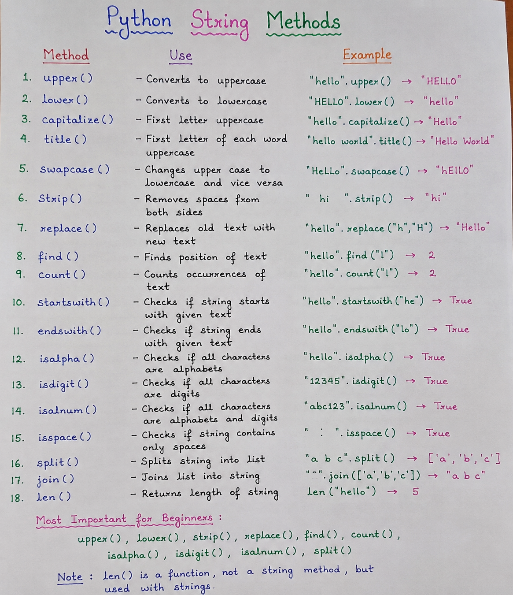
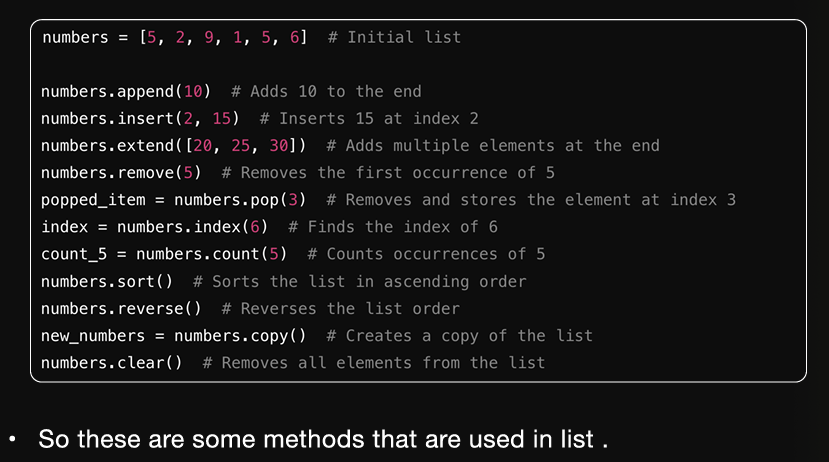
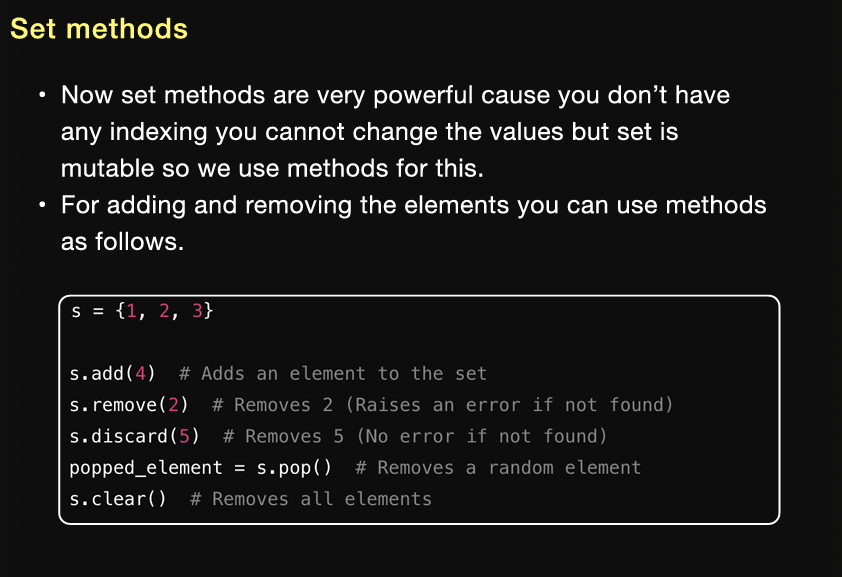
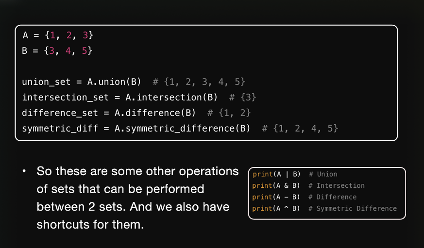
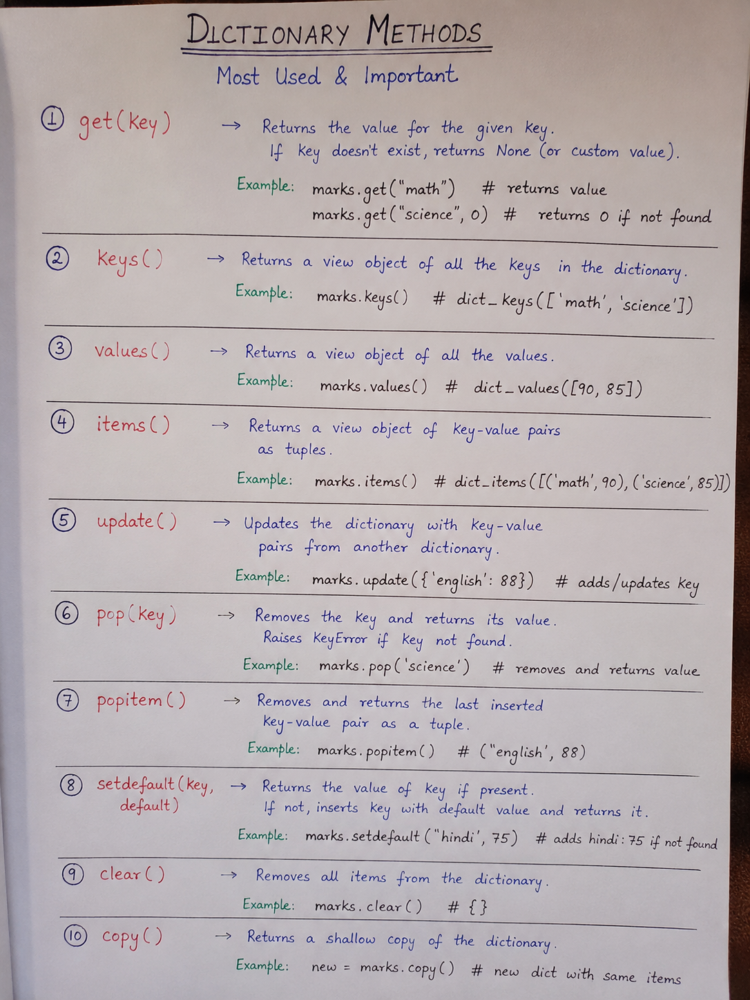
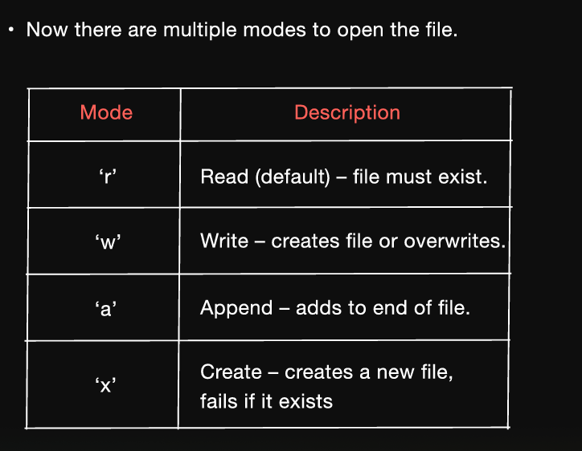

## Python String Methods in Human written

**chapter 6 problem 5 important one for "in"**

end= "" ----> this doesnt make new line 

round(67.23455,2) ----> this round function will round off the number till 2 decimal places

### 66 page number important about args and kwargs
